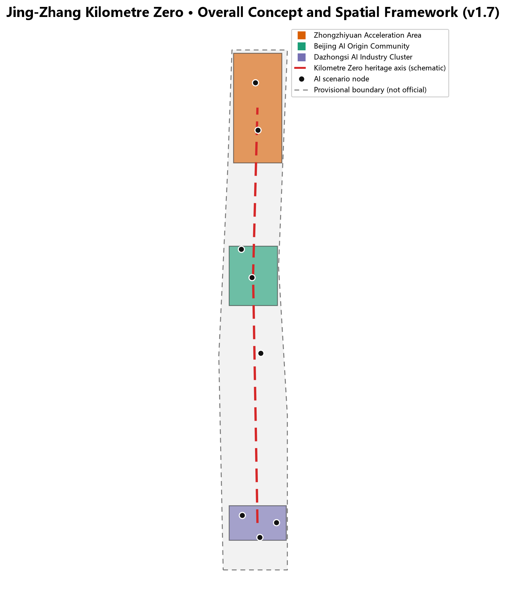
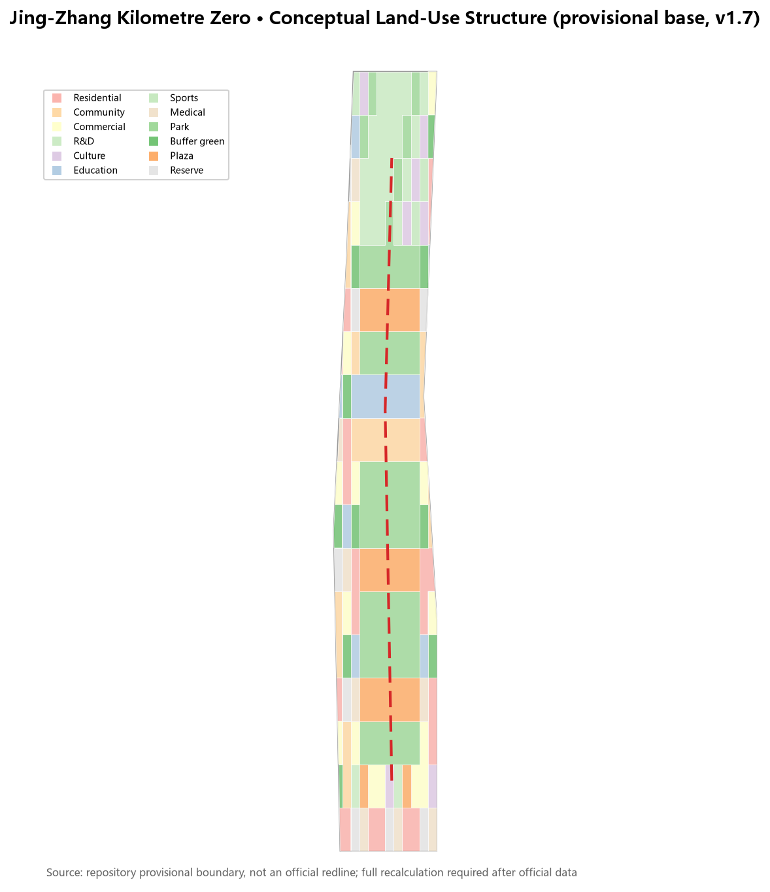
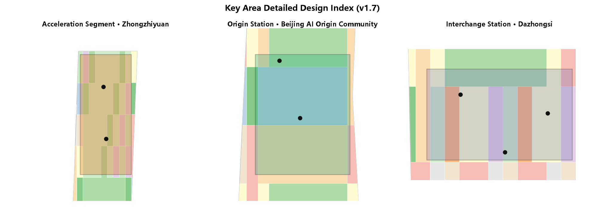
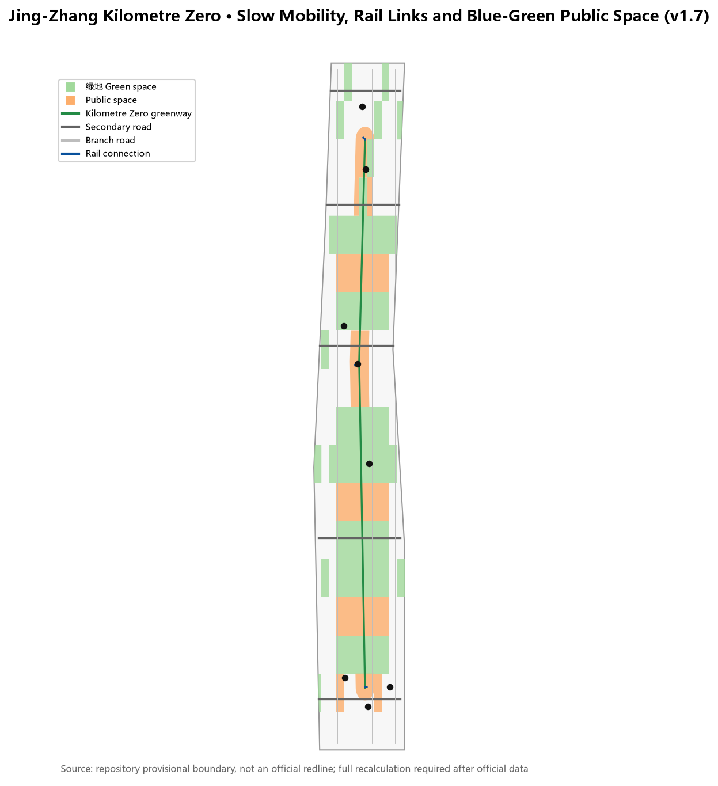
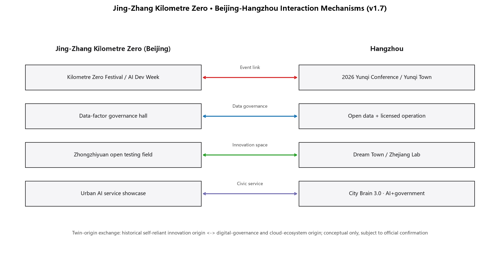
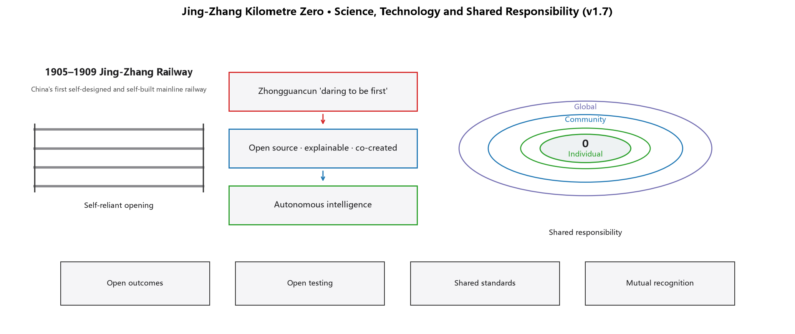
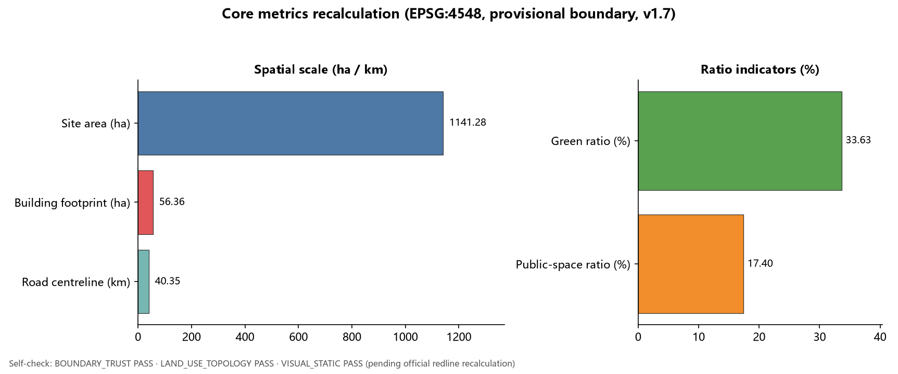

# Jing-Zhang Kilometre Zero

## One-Page Overview

- **Concept**: redefine the Jing-Zhang railway's kilometre zero as the AI-era urban starting point, where history and innovation depart together.
- **Space**: organise a "Kilometre Zero main axis" along the heritage park, connecting the Acceleration Segment (Zhongzhiyuan), Origin Station (AI Origin Community) and Interchange Station (Dazhongsi) [data:geometry/key_areas.geojson#PROV-KEY-001] [metric:key_area_count].
- **Experience**: 3 AI pilgrimage landmarks, 16 scenario cards and 7 user personas; green ratio and public-space ratio are anchored in the core metrics [metric:green_ratio] [metric:public_space_ratio].
- **Operation**: Kilometre Zero Festival in September, Global AI Developer Week in October, quarterly scenario open days, plus new interaction mechanisms with Hangzhou (event link, data governance, innovation space, civic service) [source:CASE-2026-YUNQI-CONFERENCE].
- **Shared vision**: from the first self-built mainline railway to autonomous intelligence, then to open-source co-creation and global collaboration, translating shared responsibility into experienceable public mechanisms [source:CASE-JINGZHANG-RAILWAY] [source:CASE-UNESCO-AI-ETHICS].
- **Boundary**: all spatial claims are conceptual suggestions based on the provisional boundary; full recalculation is required after the official redline [depth:metrics_recalculation].

## Design Basis and Source List

This proposal uses the Pre-Qualification Announcement for the Centennial Jing-Zhang AI Innovation Belt International Urban Design Solicitation by the Haidian Branch of the Beijing Municipal Commission of Planning and Natural Resources as its primary basis, and the machine-readable package under `brief/site-package/` as its execution basis. It fully reads `design_brief.json`, `agent_taskbook.json`, `allowed_design_space.json`, the source list, enums, planning limit ranges, schemas and the provisional boundary file [source:OFFICIAL-ANNOUNCEMENT] [source:SITE-PACKAGE]. Because the official redline is not yet public, this proposal generates and presents its spatial work with the maintainer-registered provisional rough boundary and never presents it as an official redline or precise area basis [source:BOUNDARY-SOURCE].

Source-use boundaries follow `data/source_registry.json`: formal conclusions rely only on `usable_for_formal="yes"` public sources, while background and provisional materials serve narrative, case study and discussion only [source:SOURCE-REGISTRY]. `data/processed/agent_fact_pack.md` is a navigation layer; factual judgements return to the original announcement and taskbook [source:PROCESSED-FACT-PACK] [source:AGENT-TASKBOOK].

This proposal is a total-concept experiment for the three positioning statements: Centennial Jing-Zhang Cultural Belt, Urban AI Life Experience Belt, and AI-Integrated Innovation Belt [standard:PROJECT-AGENT-OPEN-CALL-TASKBOOK]. Its core claim is to **redefine the "kilometre zero" of the Jing-Zhang Railway as the urban starting point of the AI era** — history departed from here, and innovation departs from here again. Every spatial conclusion is expressed as a conceptual suggestion, reference scheme, or material for professional teams to deepen, and does not constitute regulatory-plan adjustment, approval judgement, or implementation commitment [standard:PROJECT-OFFICIAL-ANNOUNCEMENT] [depth:existing_conditions_diagnosis].

## Three-Level Scope Framework

The three scope levels follow the announcement: the coordinated research area of about 43.6 km² answers how the AI industry ecosystem and future city form are organised; the overall design area of about 11.4 km² carries regulatory-plan-depth urban design and the urban renewal framework; and the key detailed design area of about 368.4 hectares covers Zhongzhiyuan, the Beijing AI Origin Community, and Dazhongsi [source:OFFICIAL-ANNOUNCEMENT] [data:geometry/site_boundary.geojson#SITE-001] [metric:site_area_sqm].

The "Kilometre Zero" concept transmits across the three levels: the coordinated research level builds a macro model of "timeline–innovation chain–public-space belt"; the overall design level translates the model into a spatial structure of "zero-kilometre main axis plus three station-like core areas plus two wings"; and the key area level refines the structure into experienceable neighbourhood moves [depth:three_level_scope_framework] [depth:overall_spatial_structure].

The three key areas are named through a railway-travel metaphor: Zhongzhiyuan AI Autonomous Innovation Acceleration Area is the **acceleration segment** (from origin to full-stack system), the Beijing AI Origin Community is the **origin station** (where every journey begins), and the Dazhongsi AI Industry Cluster is the **interchange station** (where innovation meets urban life) [data:geometry/key_areas.geojson#PROV-KEY-001] [data:geometry/key_areas.geojson#PROV-KEY-002] [data:geometry/key_areas.geojson#PROV-KEY-003]. The Zhongguancun Technology Service Wing and the Xiaoyuehe Scenario Empowerment Wing act as branch lines carrying capital, factors, scenarios and talent in both directions [source:AGENT-TASKBOOK].

## Coordinated Research Area: Industry and Future City Research

The coordinated research area must answer how a world-class AI innovation ecosystem is organised. This proposal offers an "innovation chain departing from kilometre zero": university origin → open-source collaboration → enterprise transformation → public experience → international dissemination, with each link mapped to spaces, platforms and operation moves [standard:PROJECT-AGENT-OPEN-CALL-TASKBOOK].

Global AI innovation ecosystem case studies (eight publicly verifiable background cases used only for mechanism transfer):

| Case | Place | Transferable experience | Haidian mechanism |
| --- | --- | --- | --- |
| King's Cross regeneration | London | Railway industrial heritage transformed into an innovation quarter with public space first | Heritage park vitality belt as leading renewal [source:CASE-KINGS-CROSS] |
| Kendall Square | Boston | Universities, enterprises, small streets and public living rooms coexist | Near-campus incubation and street vitality in the Origin Community [source:CASE-KENDALL-SQUARE] |
| one-north | Singapore | National labs, industry parks and liveable districts as one system | Zhongzhiyuan full-stack system and talent community [source:CASE-ONE-NORTH] |
| High Tech Campus | Eindhoven | Open campus, public living room and knowledge-sharing spaces | Open testing and low-carbon innovation exchange in Zhongzhiyuan [source:CASE-EINDHOVEN] |
| Yunqi Town | Hangzhou | Annual conference drives industry community and scenario opening | Global AI activity week and scenario open days [source:CASE-YUNQI] |
| Shibuya/Marunouchi | Tokyo | Railway hubs, innovation industry and public-space co-operation | Dazhongsi station integration and four-quadrant walking connectivity [source:CASE-TOKYO] |
| South Lake Union | Seattle | University-hospital-enterprise ecosystem with street-level public realm | Near-campus transformation and street vitality in the Origin Community [source:CASE-SEATTLE-SLU] |
| Digital Media City | Seoul | Media/ICT cluster with event-driven district operation | Digital content display and annual event system in Dazhongsi [source:CASE-SEOUL-DMC] |

Brand visual system directions: the primary logo direction superimposes "0" with railway sleepers (historical kilometre zero); alternatives are a signal-light colour sequence (translating centennial railway signals into innovation signals) and a "milestone post + QR code" combination linking physical landmarks with open-source projects online. Wayfinding components include kilometre-zero milestones, signal-colour guidance strips, contributor nameplates and open-source achievement display racks. Colour semantics: railway dark grey as base, signal red for "departure", ecological green for "public space", and technology blue for "innovation service" [source:AGENT-TASKBOOK] [standard:PROJECT-AGENT-OPEN-CALL-TASKBOOK].

These cases are mechanism references only and imply no commitment about enterprises, investment or policy [depth:overall_spatial_structure]. The five functions are translated as: AI full-stack autonomous innovation → acceleration segment; world-class AI innovation ecosystem → origin station; AI+ scenario empowerment paradigm → life line; intelligent AI vibrant city → public-space belt; global voice in AI governance → governance protocol and open-source display system [source:AGENT-TASKBOOK].

## Overall Design Area: Urban Renewal and Regulatory-Plan-Level Urban Design

The overall design area is organised around the "Kilometre Zero Main Axis": a continuous public-space and slow-mobility spine along the Jing-Zhang heritage park, connecting the three station-like core areas and extending outward to the two wings [standard:MOHURD-URBAN-DESIGN-MEASURES] [data:geometry/roads.geojson#ROAD-001].

The land-use structure adopts a composite zoning of "park skeleton + innovation courtyards + living blocks": parks and plazas along the main axis, research, education, commercial and mixed functions in the three core areas, and residential, community-service and flexible reserve land in the periphery [standard:MNR-LAND-USE-CLASSIFICATION-GUIDE] [data:geometry/land_use.geojson#LU-001] [metric:green_ratio]. The land-use zoning is a conceptual ratio for professional deepening and does not replace statutory regulatory planning [depth:land_use_layout].

The urban renewal framework follows "light pilot first, addition later": first repair slow-mobility breaks along the heritage park, open public space and temporary activity sites; then advance courtyard-style renewal in the core areas when ownership and regulatory conditions are confirmed [depth:development_intensity_controls] [data:geometry/phasing.geojson#PHASE-001]. Floor area ratio, building height, setbacks and road redlines are listed as pending official confirmation [source:SITE-PACKAGE] [metric:floor_area_ratio].

## Detailed Design of Key Areas

### Zhongzhiyuan AI Autonomous Innovation Acceleration Area (Kilometre Zero · Acceleration Segment)

Positioning: a garden-type full-stack autonomous innovation quarter. Spatial moves: organise a low-carbon innovation frontage along Qinghe, provide open testing fields, safety-governance display and industry release space; use green space as the public living room hosting AI testing, standards workshops and governance discussion [data:geometry/key_areas.geojson#PROV-KEY-001] [data:geometry/green_space.geojson#GREEN-001].

### Beijing AI Origin Community (Kilometre Zero · Origin Station)

Positioning: a near-campus transformation and talent community. Spatial moves: stitch campus, park and neighbourhood slow-mobility links; provide an open-source release hall, transformation service stations, talent services and a youth public living room; translate the historical image of Qinghuayuan Station into the cultural node of the "zero-kilometre origin" [data:geometry/key_areas.geojson#PROV-KEY-002] [data:geometry/scenario_nodes.geojson#NODE-001].

### Dazhongsi AI Industry Cluster (Kilometre Zero · Interchange Station)

Positioning: an urban intelligent-economy and international-exchange quarter. Spatial moves: organise four-quadrant walking connectivity around Dazhongsi station, and provide an international showcase hall, agent and smart-terminal displays, data-factor service interfaces and commercial public space [data:geometry/key_areas.geojson#PROV-KEY-003] [data:geometry/public_space.geojson#PUBLIC-001].

Each key area reaches the readable mini-scheme depth of "positioning + spatial structure + building renewal + transport and slow mobility + public space + AI scenarios + implementation risks"; layer and metric evidence is in `geometry/key_areas.geojson` and `metrics.json` [depth:three_key_area_detailed_design] [metric:key_area_count].

## AI Innovation Ecosystem, Personas, and AI+ Scenarios

Following the agent open-call taskbook, this proposal provides 16 scenario cards, 7 user personas, 3 industry test-and-validation scenarios and 3 AI pilgrimage landmarks [source:AGENT-TASKBOOK] [standard:PROJECT-AGENT-OPEN-CALL-TASKBOOK].

User personas:

| Persona | Typical needs | Spatial response |
| --- | --- | --- |
| Open-source developer | Release, collaboration, testing, community reputation | Open-source release hall, contribution display, night collaboration space at the Origin Station [data:geometry/constraints.geojson#NODE-002] |
| Startup team | Low-cost office, compute access, product testing | Shared testing field, edge-compute service, governance consultation at the Acceleration Segment [data:geometry/constraints.geojson#NODE-003] |
| Enterprise visitor | Showcase, business, international reception | International showcase hall, rail connection and public environment at the Interchange Station [data:geometry/constraints.geojson#NODE-004] |
| Local resident | Commute, leisure, low-disturbance renewal | Heritage-park slow-mobility hub, embedded community services, graded activities [data:geometry/constraints.geojson#NODE-005] |
| University student and faculty | Transformation, cross-campus collaboration, daily walking | Campus-park stitching, transformation service stations, AI education experience [data:geometry/constraints.geojson#NODE-007] |
| Older resident | Barrier-free mobility, parallel human services, community companionship | Barrier-free digital guide, retained human counters, embedded community services |
| International developer/visitor | International exchange, language accessibility, open-source collaboration | International showcase hall, multilingual wayfinding, bilingual open-source community interface [data:geometry/constraints.geojson#NODE-004] |

Scenario cards (16):

| No. | Scenario card | Spatial carrier | Type | Data and human-review boundary |
| --- | --- | --- | --- | --- |
| 01 | Kilometre Zero AI Guide | Heritage park cultural axis | Public experience | Guide text requires cultural, copyright and fact review [source:SCENARIO-REGISTRY] |
| 02 | Open-Source Release Hall | Origin Station | Community operation | Aggregated statistics only; no personal trajectory collection |
| 03 | AI Testing Sandbox | Acceleration Segment | Industry test and validation | Authorised test data; safety evaluation with human review |
| 04 | International Showcase Hall | Interchange Station | Industry service | Enterprise logos and cases displayed only after clearance |
| 05 | Heritage-Park Slow-Mobility Hub | Main axis | Public experience | Low-intrusion collection of slow-mobility and accessibility data [source:SCENARIO-REGISTRY] |
| 06 | Qinghe Low-Carbon Innovation Frontage | Acceleration Segment waterfront | Public experience | Ecological and flood conditions require professional review |
| 07 | Youth Vitality Plaza | Wudaokou area | Youth-friendly | Graded night activities with noise and safety assessment |
| 08 | Enterprise Service Copilot Station | Interchange Station and corridor | Industry test and validation | Policy, scenario and compliance Q&A requires human review [source:SCENARIO-REGISTRY] |
| 09 | AI Life Service Demonstration Street | Living blocks | Public service | AI health, education and legal services require sector compliance review |
| 10 | Low-Speed Delivery Pilot | Main-axis public space | Industry test and validation | Low-speed, supervised, reversible; safety officer on site |
| 11 | Global AI Activity Week Route | Belt public space | Operation | Activity safety, copyright and site permits precede operation |
| 12 | Kilometre Zero Monument | Origin Station / heritage park | Honour display | Monument and honour system approved by the organisers |
| 13 | AI+ Education Experience Point | University-community interface | Public service | Teaching data anonymised; content reviewed by education institutions |
| 14 | AI+ Health Service Station | Living blocks and health facilities | Public service | Triage and health literacy only; diagnoses require physician review |
| 15 | Barrier-Free Digital Guide | Full heritage park | Public service | Voice/tactile/multilingual content requires accessibility and copyright review |
| 16 | Data-Factor Governance Display | Interchange data living room | Industry display | Data-flow demos use synthetic data and are labelled as non-real transactions |

Each scenario card states its service users, spatial location, data sources, privacy boundary, human-review mechanism and operating body; the complete mapping is in `compliance_matrix.json` and the visual page [depth:metrics_recalculation].

AI pilgrimage landmarks (3):

1. **Kilometre Zero Monument**: near the Origin Station, expressing the superposition of "historical kilometre zero → AI kilometre zero" through railway milestone symbols [data:geometry/constraints.geojson#NODE-001].
2. **Open-Source Achievement Gallery**: along the heritage-park main axis, displaying open-source projects, contributors and annual milestones.
3. **Agent Contribution Honour Wall**: for global agents and developers, aligned with the organisers' memorial system and built only after organiser approval.

## Land Use, Building Scale, and Retain-Renovate-Demolish Strategy

The land-use plan expresses conceptual zoning following the logic of national territorial survey, planning and use classification, covering the full submitted boundary without gaps or overlaps [standard:MNR-LAND-USE-CLASSIFICATION-GUIDE] [data:geometry/land_use.geojson#LU-001]. Research, education, commercial and community-service land concentrate around the three core areas; parks and plazas distribute along the main axis; residential and flexible reserve land form the periphery [metric:green_ratio] [metric:public_space_ratio].

The building layer expresses conceptual footprints and renewal actions: retention, renovation and near-campus incubation dominate the Origin Station; new research and testing buildings dominate the Acceleration Segment; renovation and mixed functions dominate the Interchange Station; existing retention dominates the periphery [data:geometry/buildings.geojson#BLDG-001] [depth:retain_renovate_demolish]. All retain-renovate-demolish statements are conceptual directions and do not reach parcel-level ownership conclusions [metric:building_footprint_area_sqm].

Development intensity and height controls are pending items: until official regulatory conditions are available, no FAR, density, setback or height values are fabricated in the narrative or metrics [depth:height_massing_character] [metric:building_height_m].

## Transport, Rail, Municipal Infrastructure, and Public Services

The transport strategy follows "Kilometre Zero Main Axis + rail connection + slow mobility first": the heritage-park axis carries walking, cycling and public activity; cross streets connect universities, enterprises and communities; the three core areas strengthen integrated rail-station connections [data:geometry/roads.geojson#ROAD-001] [depth:traffic_rail_slow_parking].

Municipal and new infrastructure is a pending deepening layer: edge-compute stations, distributed energy, smart light poles and public data-service interfaces may start as light pilots along the axis; formal scale and pipeline schemes await municipal conditions [depth:municipal_new_infrastructure] [data:geometry/constraints.geojson#CONSTRAINTS-001]. Public services are organised in four tiers: Origin Station talent services, Acceleration Segment industry services, Interchange Station international services, and living-block daily services [source:AGENT-TASKBOOK].

## Blue-Green Network, Public Space, and Urban Character

The blue-green system uses the Jing-Zhang heritage park vitality belt as its main axis, connecting the Qinghe frontage, Xiaoyuehe branch, parks and plazas into a north-south and east-west continuous slow-mobility and ecological network [data:geometry/green_space.geojson#GREEN-001] [data:geometry/public_space.geojson#PUBLIC-001] [depth:blue_green_public_space].

The urban character narrative is "centennial rails · digital signals · youthful streets": rail symbols carry historical memory, a signal-light colour system serves signage and public art, and youthful streets shape youth-friendly interfaces. The wayfinding system uses a unified "kilometre-zero milestone + signal colour" language, and the logo direction superimposes "0" with railway sleepers [source:AGENT-TASKBOOK] [standard:MOHURD-URBAN-DESIGN-MEASURES].

The cultural narrative runs: construction of the Jing-Zhang Railway began in 1905 and opened in 1909 (China's first self-designed and self-built mainline railway, the origin of self-reliant innovation), followed by Zhongguancun's "daring to be first", the new AI culture of "open source, explainable, co-created", and finally a renewed departure from "kilometre zero" [source:CASE-JINGZHANG-RAILWAY]. All historical statements use public sources and fabricate no persons or events.

## Renewal Projects, Implementation Policy, and Phasing

| No. | Project | Type | Phase | Dependencies |
| --- | --- | --- | --- | --- |
| JZ-01 | Heritage-park slow-mobility break repair | Public space / transport | Near-term | Road redlines, under-bridge space review [data:geometry/phasing.geojson#PHASE-001] |
| JZ-02 | Kilometre Zero Monument and wayfinding | Culture / brand | Near-term | Site permit, heritage and copyright clearance |
| JZ-03 | Origin Station open-source release hall | Urban renewal / industry | Mid-term | Campus boundary, ownership, ground-floor uses [data:geometry/phasing.geojson#PHASE-002] |
| JZ-04 | Acceleration Segment open testing field | Industry / public space | Mid-term | Safety evaluation, operating body, data authorisation |
| JZ-05 | Interchange Station four-quadrant walking connectivity | Rail integration | Mid-term | Station works, intersections, municipal pipelines |
| JZ-06 | Global AI Activity Week system | Operation / brand | Near-term start, long-term iteration | Event permits, international dissemination, conversion mechanisms [data:geometry/phasing.geojson#PHASE-003] |

Phasing follows three stages: near-term light pilots (2026–2028), mid-term core renewal (2028–2031), and long-term system governance (2031–2035) [data:geometry/phasing.geojson#PHASE-001] [depth:phasing_implementation]. All projects are conceptual suggestions; implementation bodies, funding and approval paths are pending items [depth:renewal_project_list].

### Annual Operation System (Conceptual Suggestion)

Annual event calendar: a Kilometre Zero Festival during the "Jing-Zhang opening commemorative week" every September (heritage narrative and public-space opening); a Global AI Developer Week every October (open-source releases, hackathons, scenario open days); and quarterly scenario open days where the AI testing sandbox, enterprise service stations and low-speed delivery pilots open for developer and public booking [source:AGENT-TASKBOOK] [depth:renewal_project_list].

Developer community operation: the Origin Station open-source release hall anchors offline community activity, supported by an online repository, issue board and a monthly "Kilometre Zero commit leaderboard"; contributors can be nominated for honour nameplates and monument inscriptions (subject to organiser approval). The Enterprise Service Copilot Station provides an offline conversion entry for policy, scenario, compute and compliance Q&A [data:geometry/constraints.geojson#NODE-002] [data:geometry/constraints.geojson#NODE-003].

| Conversion path | Audience | Space/operation carrier | Expected conversion action |
| --- | --- | --- | --- |
| Event→Experience | Public/developers | Kilometre Zero Festival, scenario open days | Register as community member, book testing sandbox |
| Experience→Co-creation | Developers/startups | Open-source release hall, hackathons | Submit open-source project, apply for incubation seat |
| Co-creation→Industry | Enterprises/institutions | Acceleration testing field, international showcase hall | Test and validate, business talks, scenario cooperation |
| Industry→Global | Leading enterprises/international institutions | Global AI activity week, international dissemination | Release outcomes, attraction and conversion, long-run cooperation |

All events, community and conversion mechanisms are conceptual suggestions and imply no confirmed government events or investment commitments [source:AGENT-TASKBOOK].

## Interaction Mechanisms with Hangzhou (Conceptual Suggestion)

Building on the global AI innovation ecosystem case studies, this proposal adds a concrete set of interaction examples with the city of Hangzhou and forms a "twin-origin exchange" narrative: the Jing-Zhang railway's kilometre zero is the historical origin of self-reliant innovation, while Hangzhou is a contemporary origin of digital governance and the cloud ecosystem; the two cities recognise each other through the meaning of "origin" and translate each other's experience into experienceable spatial and operational moves [source:CASE-2026-YUNQI-CONFERENCE] [depth:overall_spatial_structure].

| Mechanism | Jing-Zhang side | Hangzhou reference | Boundary and review |
| --- | --- | --- | --- |
| 1. Event link | September Kilometre Zero Festival and October Global AI Developer Week connect with the Yunqi Conference for joint releases | 2026 Yunqi Conference (22–24 September, Hangzhou; theme "Intelligence in Practice") | Dates and theme follow the final official announcement [source:CASE-2026-YUNQI-CONFERENCE] |
| 2. Data-factor governance | A data-factor governance display hall at the Origin Station demonstrates data minimisation, human review and a reversible sandbox | Hangzhou's open-data catalogue, licensed operation and sandbox regulation mechanisms | Data scale pending verification against the official platform; no personal trajectory collection [source:CASE-HANGZHOU-CITY-BRAIN] |
| 3. Innovation space | The Zhongzhiyuan Acceleration Segment adopts "core campus + open testing field + scenarios beyond the boundary" | Dream Town's "core with no walls" and Zhejiang Lab's mixed-ownership collaboration | Organisational model only; no institutional copying [source:CASE-DREAM-TOWN] [source:CASE-ZHEJIANG-LAB] |
| 4. Civic service exchange | The Dazhongsi Interchange Station provides an urban AI service showcase and joint drill scenario | Hangzhou City Brain 3.0 and the "AI+government service" paradigm | Requires local municipal conditions and approvals [source:CASE-HANGZHOU-CITY-BRAIN] |

At the developer-community level, mutual recognition of event badges and contributor rosters is suggested: open-source contributors who join the Kilometre Zero Festival or Global AI Developer Week may receive an equivalent identifier at Hangzhou's Yunqi Conference developer-community events, and vice versa. This is an operational concept only; concrete recognition rules require separate confirmation by both organising parties [source:CASE-2026-YUNQI-CONFERENCE] [depth:renewal_project_list].

All interaction mechanisms above are conceptual suggestions and background mechanism references: they imply no concluded cooperation, signed agreements or investment commitments between the Beijing and Hangzhou governments, and they do not change the statutory regulatory, approval or implementation boundaries of this proposal in Beijing [depth:risk_missing_data].

## Science, Technology and Shared Responsibility (Conceptual Suggestion)

This proposal understands "scientific and technological civilisation" as: innovation in a district should not serve itself alone, but should settle into public mechanisms that can be shared, re-checked and continued. Jing-Zhang Kilometre Zero adds a second narrative thread, "from autonomous innovation to co-creation": first build the ability to solve one's own problems independently, then convert that experience into reusable public goods in an open, trustworthy and collaborative way [source:CASE-JINGZHANG-RAILWAY] [source:CASE-UNESCO-AI-ETHICS] [depth:overall_spatial_structure].

Shared responsibility principles (translated into spatial and operational rules):

| Principle | Spatial/operational response | Review boundary |
| --- | --- | --- |
| Trustworthy | Open-source achievement gallery, open-source release hall | Only cleared outcomes displayed; generation and review actors labelled [source:CASE-UNESCO-AI-ETHICS] |
| Explainable | Enterprise Copilot station, governance consultation desk | Policy, scenario and compliance Q&A retain a human answer path |
| Reversible | AI testing sandbox, low-speed delivery pilot | Pilots can be stopped; safety officer on site; data used after authorisation |
| Public benefit first | Youth-friendly public space, barrier-free digital guide | Needs of older and disabled groups enter scenario design and review |

Science and technology timeline (a readable continuous street narrative):

| Stage | Historical/factual anchor | Spatial translation |
| --- | --- | --- |
| Self-reliant opening | 1905–1909 Jing-Zhang Railway (China's first self-designed and self-built mainline railway) | Kilometre Zero Monument, centennial rail symbols [source:CASE-JINGZHANG-RAILWAY] |
| Standing on innovation | Zhongguancun's "daring to be first" | Zhongguancun technology service wing, transformation service stations |
| Autonomous intelligence | Full-stack AI innovation and open-source collaboration | Acceleration Segment full-stack testing, Origin Station release hall |
| Co-creation | Open source, standards and global collaboration | Standards workshops, Global AI Developer Week, international mutual recognition |

Global open collaboration (public mechanisms for participants worldwide):

| Mechanism | Carrier | Audience |
| --- | --- | --- |
| Open outcomes | Open-source achievement gallery | Global developers, researchers, public |
| Open testing | Acceleration Segment open testing field | Startups, universities, international institutions |
| Shared standards | Standards workshops and governance discussion space | Industry, academia, public representatives |
| International recognition | Global AI Developer Week, event-badge mutual recognition | Global developer community [source:CASE-UNESCO-AI-ETHICS] |

All of the above are conceptual suggestions: they imply no new government commitment, international agreement or enterprise-cooperation statement; every shared-responsibility mechanism stays consistent with the existing data minimisation, human review and reversibility principles [depth:risk_missing_data].

## Metrics, Area Recalculation, and Compliance Matrix

Core metrics are recalculated from submitted geometry in EPSG:4548: the overall design area is about 1,141.3 ha; the three key areas are about 192.9, 104.3 and 72.0 ha; the conceptual green ratio is about 33.1%; the public-space ratio is about 23.0%; and conceptual building footprints total about 56.1 ha [metric:site_area_sqm] [metric:green_ratio] [metric:public_space_ratio].

These values are based on the provisional boundary and must be fully recalculated when the official redline is available; rounded values in the narrative follow the precise values in `metrics.json` [depth:metrics_recalculation] [data:geometry/site_boundary.geojson#SITE-001]. FAR, height, density and setback controls remain `unknown` until official conditions are available and are not rendered as numbers in the HTML [metric:floor_area_ratio].

The compliance matrix covers every mandatory item of announcement sections 1.3, 1.4 and 1.5 and agent tasks agent.1–agent.6, each mapped to report sections, layers, metrics, drawings, HTML sections, sources, assumptions and self-check items [source:SOURCE-REGISTRY] [metric:key_area_count].

## Risk, Copyright, and Compliance

Main risks and responses: missing official redline (provisional boundary used and marked for recalculation); missing regulatory controls (listed as unknown); scenario data and privacy (data minimisation, human review, reversibility); historical and cultural statements (public sources only, with clearance); events and branding (not presented as confirmed government arrangements) [depth:risk_missing_data] [data:geometry/constraints.geojson#CONSTRAINTS-005].

Copyright and compliance: this proposal's text, geometry, diagrams and static pages are generated by the declared AI agent; sources are registered in `sources.json`, fonts and assets are described in `report/copyright_statement.md`, and the HTML is an offline static page with no remote resources [source:SITE-PACKAGE]. This proposal claims no official approval, approved regulatory plan, final ownership or guaranteed implementation; AI generation responsibility is borne by phdetector, and final judgement rests with humans and professional teams [standard:PROJECT-AGENT-OPEN-CALL-TASKBOOK].

## References

- Pre-Qualification Announcement for the Centennial Jing-Zhang AI Innovation Belt International Urban Design Solicitation (Haidian Branch, Beijing Municipal Commission of Planning and Natural Resources)
- brief/public-brief.md, brief/site-package/design_brief.json, agent_taskbook.json, allowed_design_space.json, sources.json, enums/, ranges/, standards/
- data/source_registry.json, data/processed/agent_fact_pack.md and companion processed files
- Complete machine index: sources.json, metrics.json, compliance_matrix.json, standard_matrix.json, design_depth_matrix.json
- Case sources: King's Cross, Kendall Square, one-north, High Tech Campus, Yunqi Town, Tokyo rail hubs, South Lake Union, Digital Media City (see sources.json)
- Hangzhou interaction sources: 2026 Yunqi Conference, Hangzhou City Brain 3.0, Zhejiang Lab, Dream Town (see sources.json)
- Science, technology and shared responsibility sources: Jing-Zhang Railway (background reference; awaiting official historical review), UNESCO Recommendation on the Ethics of Artificial Intelligence (see sources.json)

The complete machine index and source-use boundaries are in `sources.json` and `compliance_matrix.json` [source:SITE-PACKAGE].
