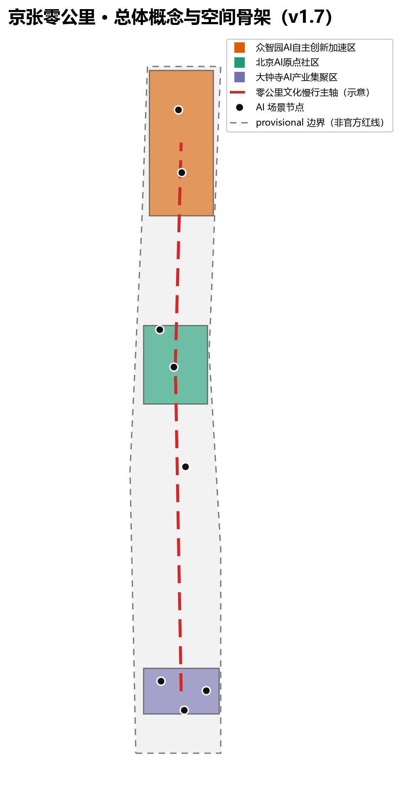
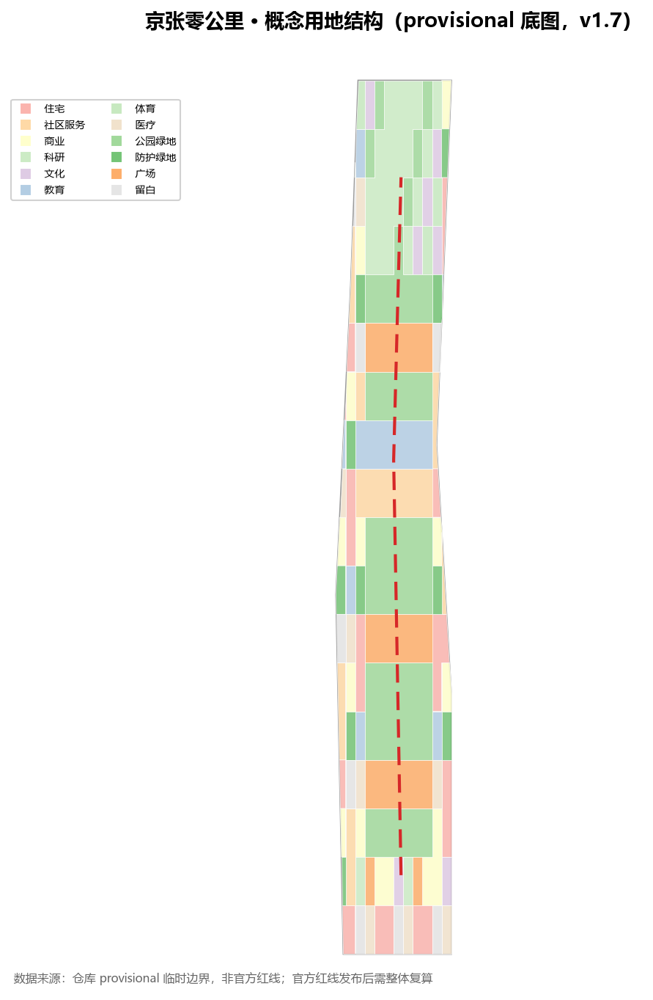
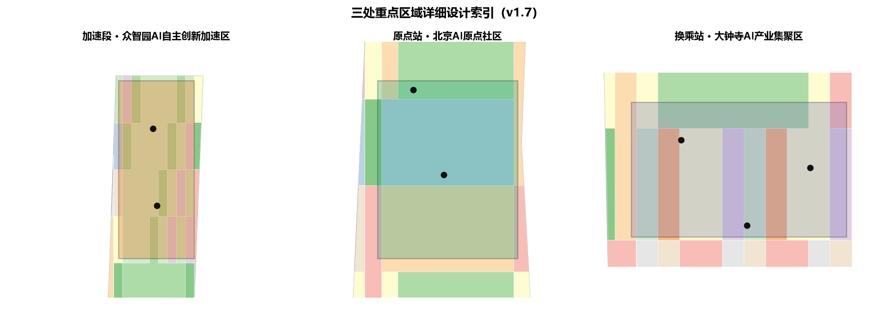
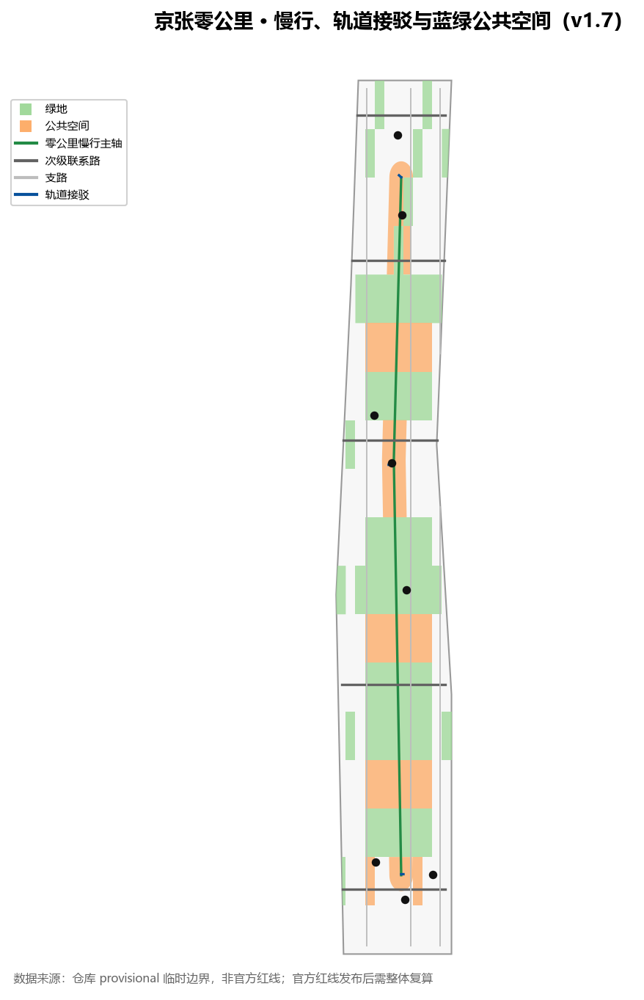
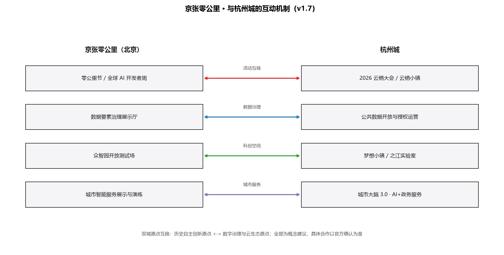
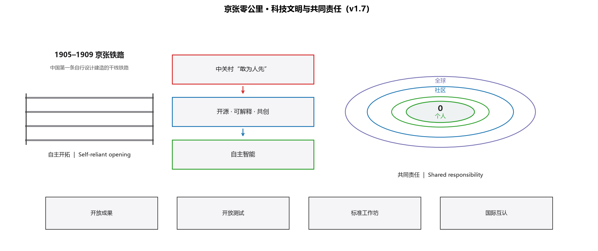
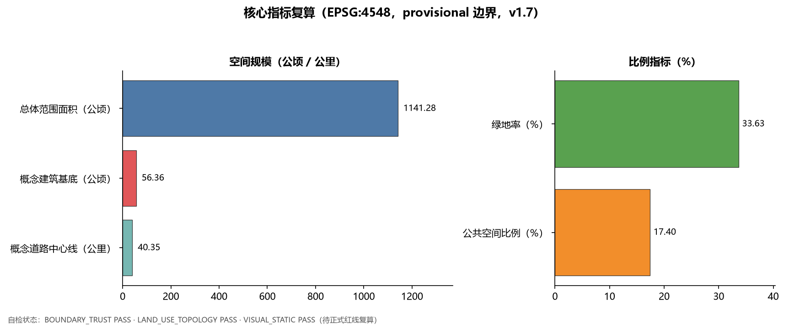

# 京张零公里 Kilometre Zero

## 一页先读

- **概念**：把京张铁路零公里重新定义为 AI 时代城市起点，历史与创新同源出发。
- **空间**：沿京张遗址公园组织“零公里主轴”，串联加速段（众智园）、原点站（AI 原点社区）、换乘站（大钟寺）三处站点式核心区 [data:geometry/key_areas.geojson#PROV-KEY-001] [metric:key_area_count]。
- **体验**：3 处 AI 朝圣地标、16 张场景卡、7 类用户画像；绿地率与公共空间比例见核心指标 [metric:green_ratio] [metric:public_space_ratio]。
- **运营**：9 月零公里节、10 月全球 AI 开发者周、季度场景开放日，并新增与杭州城的互动机制（活动互链、数据治理、科创空间、城市服务）[source:CASE-2026-YUNQI-CONFERENCE]。
- **共同愿景**：从首条自建干线铁路到自主智能，再到开源共创与全球协作，把共同责任落为可体验的公共机制 [source:CASE-JINGZHANG-RAILWAY] [source:CASE-UNESCO-AI-ETHICS]。
- **边界**：全部空间主张为概念建议，基于 provisional 边界；官方红线发布后整体复算 [depth:metrics_recalculation]。

## 设计依据与资料清单

本方案以北京市规划和自然资源委员会海淀分局《百年京张AI创新带城市设计国际方案征集资格预审公告》为第一依据，以仓库 `brief/site-package/` 的机器可读任务包为执行依据，并完整读取了 `design_brief.json`、`agent_taskbook.json`、`allowed_design_space.json`、来源清单、枚举、指标区间、schema 与临时边界文件 [source:OFFICIAL-ANNOUNCEMENT] [source:SITE-PACKAGE]。正式红线尚未公开时，本方案采用维护者登记的 provisional 粗略边界生成并展示，绝不冒充官方红线或精确面积依据 [source:BOUNDARY-SOURCE]。

资料用途边界按 `data/source_registry.json` 登记表执行：formal 结论只使用 `usable_for_formal="yes"` 的公开来源，背景与临时资料只用于叙事、案例和讨论 [source:SOURCE-REGISTRY]。`data/processed/agent_fact_pack.md` 只作为任务导航层，事实判断回到原始公告与任务书 [source:PROCESSED-FACT-PACK] [source:AGENT-TASKBOOK]。

本方案是「百年京张文化带、都市AI生活体验带、AI融合创新带」三大定位的一次总概念实验 [standard:PROJECT-AGENT-OPEN-CALL-TASKBOOK]。核心主张是：**把京张铁路的“零公里”重新定义为 AI 时代的城市起点**——历史从这里出发，创新也从这里出发。所有空间结论均以概念建议、参考方案或可供专业团队深化的形式表述，不构成控规调整、审批判断或实施承诺 [standard:PROJECT-OFFICIAL-ANNOUNCEMENT] [depth:existing_conditions_diagnosis]。

## 三层范围工作框架

三层范围按公告要求组织：统筹研究范围约 43.6 平方公里，回答 AI 产业生态与未来城市形态；总体设计范围约 11.4 平方公里，承担控规深度城市设计与城市更新框架；重点区域范围约 368.4 公顷，对众智园、AI 原点社区、大钟寺三处开展详细设计 [source:OFFICIAL-ANNOUNCEMENT] [data:geometry/site_boundary.geojson#SITE-001] [metric:site_area_sqm]。

「零公里」概念在三层范围中的传导方式是：统筹研究层建立“时间线—创新链—公共空间带”的宏观模型；总体设计层把模型落为“零公里主轴＋三处站点式核心区＋两翼支线”的空间结构；重点区域层把结构细化为可体验的街区动作 [depth:three_level_scope_framework] [depth:overall_spatial_structure]。

三处重点区按铁路旅行隐喻命名：众智园AI自主创新加速区＝**加速段**（从原点到全栈体系），北京AI原点社区＝**原点站**（一切旅程的起点），大钟寺AI产业集聚区＝**换乘站**（创新与城市生活交汇）[data:geometry/key_areas.geojson#PROV-KEY-001] [data:geometry/key_areas.geojson#PROV-KEY-002] [data:geometry/key_areas.geojson#PROV-KEY-003]。中关村科技服务翼与小月河场景赋能翼作为“支线”，承担资本、要素、场景与人才的双向输送 [source:AGENT-TASKBOOK]。

## 统筹研究范围产业与未来城市研究

统筹研究范围应回答“世界级 AI 创新生态如何组织”。本方案提出「从零公里出发的创新链」：高校策源→开源协作→企业转化→公共体验→国际传播，五个环节分别对应空间、平台与运营动作 [standard:PROJECT-AGENT-OPEN-CALL-TASKBOOK]。

全球 AI 创新生态案例研究（本方案选取 8 个，全部为公开可查的背景案例，仅作经验转化参考）：

| 案例 | 地点 | 可转化经验 | 对应海淀机制 |
| --- | --- | --- | --- |
| King's Cross 更新 | 伦敦 | 铁路工业遗产区转型为创新街区，公共空间先行 | 京张遗址公园活力带先导更新 [source:CASE-KINGS-CROSS] |
| Kendall Square | 波士顿 | 高校、企业、小尺度街道与公共客厅共生 | AI 原点社区近校孵化与街道活力 [source:CASE-KENDALL-SQUARE] |
| one-north 纬壹科技城 | 新加坡 | 国家实验室、产业园区与宜居街区一体化 | 众智园全栈自主体系与人才社区 [source:CASE-ONE-NORTH] |
| High Tech Campus | 埃因霍温 | 开放式园区、公共客厅与知识共享空间 | 众智园开放测试与低碳创新交往 [source:CASE-EINDHOVEN] |
| 云栖小镇 | 杭州 | 年度大会驱动产业社区与场景开放 | 全球 AI 活动周与场景开放日 [source:CASE-YUNQI] |
| 涩谷/丸之内 | 东京 | 轨道枢纽、创新产业与公共空间复合运营 | 大钟寺站一体化与四象限步行连通 [source:CASE-TOKYO] |
| South Lake Union | 西雅图 | 大学-医院-企业生态与街道公共空间协同 | 原点社区近校转化与街道活力 [source:CASE-SEATTLE-SLU] |
| Digital Media City | 首尔 | 媒体/ICT 集群与活动驱动片区运营 | 大钟寺数字内容展示与年度活动体系 [source:CASE-SEOUL-DMC] |

品牌视觉系统方向：Logo 主方向为“0”与枕木叠合（历史零公里），备选方向为信号灯色块序列（百年铁路信号转译为创新信号）与“里程桩+二维码”组合（线下地标与线上开源项目互链）；导视组件包括零公里里程碑、信号色导视带、贡献者铭牌与开源成果展示架；色彩语义以铁路深灰为底、信号红为“出发”、生态绿为“公共空间”、科技蓝为“创新服务” [source:AGENT-TASKBOOK] [standard:PROJECT-AGENT-OPEN-CALL-TASKBOOK]。

以上案例只作为机制参考，不构成对任何企业、投资或政策的承诺 [depth:overall_spatial_structure]。五大功能在本方案中的转译是：AI全栈自主创新体系→加速段；世界级AI创新生态→原点站；AI+场景赋能新范式→生活线；智能化AI活力城市→公共空间带；AI治理全球话语权→治理协议与开源展示体系 [source:AGENT-TASKBOOK]。

## 总体设计范围城市更新与控规深度城市设计

总体设计范围以“零公里主轴”为骨架：沿京张遗址公园组织一条连续的公共空间与慢行主轴，串联三处站点式核心区，并向外连接两翼支线 [standard:MOHURD-URBAN-DESIGN-MEASURES] [data:geometry/roads.geojson#ROAD-001]。

用地结构采用「公园骨架＋创新院落＋生活街坊」的复合分区：主轴两侧布置公园绿地与广场，三处核心区布置科研、教育、商业与混合功能，外围布置住宅、社区服务与留白弹性用地 [standard:MNR-LAND-USE-CLASSIFICATION-GUIDE] [data:geometry/land_use.geojson#LU-001] [metric:green_ratio]。用地分区是概念性配比，供专业团队深化，不替代法定控规 [depth:land_use_layout]。

城市更新总体框架强调“轻量先导、增量后补”：先修复遗址公园慢行断点、开放公共空间与临时活动场地，再结合权属与控规条件推进核心区院落式更新 [depth:development_intensity_controls] [data:geometry/phasing.geojson#PHASE-001]。涉及容积率、建筑高度、退线与道路红线的内容，一律列为待官方控规确认 [source:SITE-PACKAGE] [metric:floor_area_ratio]。

## 重点区域详细设计

### 众智园AI自主创新加速区（零公里·加速段）

定位为花园型全栈自主创新街区。空间动作：沿清河组织低碳创新界面，设置开放测试场、安全治理展示与产业发布空间；把绿色空间作为公共客厅，承载 AI 测试、标准工作坊与治理讨论 [data:geometry/key_areas.geojson#PROV-KEY-001] [data:geometry/green_space.geojson#GREEN-001]。

### 北京AI原点社区（零公里·原点站）

定位为近校型成果转化与人才社区。空间动作：缝合校区、园区与街区慢行联系，设置开源发布厅、成果转化驿站、人才服务与青年公共客厅；把“清华园站”的历史意象转化为“零公里起点”的文化节点 [data:geometry/key_areas.geojson#PROV-KEY-002] [data:geometry/constraints.geojson#NODE-001]。

### 大钟寺AI产业集聚区（零公里·换乘站）

定位为城市型智能经济与国际交往街区。空间动作：围绕大钟寺站组织四象限步行连通，设置国际路演客厅、智能体与智能终端展示、数据要素服务界面和商业公共空间 [data:geometry/key_areas.geojson#PROV-KEY-003] [data:geometry/public_space.geojson#PUBLIC-001]。

三处重点区均达到“定位＋空间结构＋建筑更新＋交通慢行＋公共空间＋AI场景＋实施风险”的可读小方案深度，图层与指标证据见 `geometry/key_areas.geojson` 与 `metrics.json` [depth:three_key_area_detailed_design] [metric:key_area_count]。

## AI 创新生态、人才画像与 AI+ 场景

面向智能体任务书要求，本方案提供 16 张场景卡、7 类用户画像、3 个产业测试验证场景和 3 处 AI 朝圣地标 [source:AGENT-TASKBOOK] [standard:PROJECT-AGENT-OPEN-CALL-TASKBOOK]。

用户画像：

| 画像 | 典型需求 | 空间响应 |
| --- | --- | --- |
| 开源开发者 | 发布、协作、测试、社区声誉 | 原点站开源发布厅、代码贡献展示、夜间协作空间 [data:geometry/constraints.geojson#NODE-002] |
| 初创团队 | 低成本办公、算力入口、产品试验场 | 加速段共享测试场、端侧算力驿站、治理咨询 [data:geometry/constraints.geojson#NODE-003] |
| 头部企业访客 | 展示、商务、国际接待 | 换乘站国际路演客厅、轨道接驳与公共环境 [data:geometry/constraints.geojson#NODE-004] |
| 周边居民 | 通勤、休闲、低扰动更新 | 遗址公园慢行驿站、社区服务嵌入、活动分级 [data:geometry/constraints.geojson#NODE-005] |
| 高校师生 | 成果转化、跨校协作、日常慢行 | 校区-园区慢行缝合、成果转化驿站、AI 教育体验 [data:geometry/constraints.geojson#NODE-007] |
| 老年居民 | 无障碍出行、传统服务并行、社区陪伴 | 无障碍数字导览、人工窗口保留、社区服务嵌入 |
| 外籍开发者/访客 | 国际交流、语言无障碍、开源协作 | 国际路演客厅、多语导视、开源社区双语界面 [data:geometry/constraints.geojson#NODE-004] |

场景卡（16 张）：

| 编号 | 场景卡 | 空间载体 | 类型 | 数据与人工复核边界 |
| --- | --- | --- | --- | --- |
| 01 | 零公里·AI 导览 | 遗址公园文化轴线 | 公共体验 | 导览文本须文化、版权与事实复核 [source:SCENARIO-REGISTRY] |
| 02 | 开源发布厅 | 原点站 | 社区运营 | 代码与活动数据聚合统计，不采集个人轨迹 |
| 03 | AI 测试沙盒 | 加速段 | 产业测试验证 | 测试数据授权使用，安全评测人工复核 |
| 04 | 国际路演客厅 | 换乘站 | 产业服务 | 企业标识与案例清权后展示 |
| 05 | 遗址公园慢行驿站 | 主轴沿线 | 公共体验 | 慢行与无障碍数据低侵入采集 [source:SCENARIO-REGISTRY] |
| 06 | 清河低碳创新界面 | 加速段滨水 | 公共体验 | 生态与防洪条件须专业复核 |
| 07 | 青年活力广场 | 五道口周边 | 青年友好 | 夜间活动分级管理，噪音与安全评估 |
| 08 | 企业服务 Copilot 驿站 | 换乘站及沿线 | 产业测试验证 | 政策、场景、合规问答须人工复核 [source:SCENARIO-REGISTRY] |
| 09 | AI 生活服务样板街 | 生活街坊 | 公共服务 | 医疗、教育、法律类 AI 服务须行业合规复核 |
| 10 | 低速无人配送试点 | 主轴公共空间 | 产业测试验证 | 低速、可监管、可退出，安全员在场 |
| 11 | 全球 AI 活动周路线 | 一带公共空间 | 运营活动 | 活动安全、版权与场地许可前置 |
| 12 | 零公里纪念碑 | 原点站/遗址公园 | 荣誉展示 | 碑刻与荣誉体系由主办方审批 |
| 13 | AI+教育体验点 | 高校与社区交界 | 公共服务 | 教学数据脱敏，内容由教育机构复核 |
| 14 | AI+医疗健康驿站 | 生活街坊与医疗设施 | 公共服务 | 仅提供导诊与健康科普，诊疗结论须医师复核 |
| 15 | 无障碍数字导览 | 遗址公园全段 | 公共服务 | 语音/触觉/多语内容须无障碍与版权复核 |
| 16 | 数据要素治理展示 | 换乘站数据会客厅 | 产业展示 | 数据流通演示使用合成数据，标注非真实交易 |

每张场景卡均说明服务对象、空间位置、数据来源、隐私边界、人工复核与运营主体，完整映射见 `compliance_matrix.json` 与视觉页 [depth:metrics_recalculation]。

AI 朝圣地标（3 处）：

1. **零公里纪念碑**：位于原点站附近，以铁路里程碑符号表达“历史零公里→AI 零公里”的叠合叙事 [data:geometry/constraints.geojson#NODE-001]。
2. **开源成果展示廊**：沿遗址公园主轴设置，展示开源项目、贡献者与年度里程碑。
3. **智能体贡献荣誉墙**：面向全球 Agent 与开发者，与主办方纪念体系衔接，由主办方审批建设。

## 用地、建筑规模与拆改留方案

用地方案依据国土空间用地用海分类逻辑表达概念分区，覆盖全部提交边界、无缝隙无重叠 [standard:MNR-LAND-USE-CLASSIFICATION-GUIDE] [data:geometry/land_use.geojson#LU-001]。概念用地中，科研、教育、商业与社区服务用地沿三处核心区集中，公园绿地与广场沿主轴分布，住宅与留白弹性用地组织在外围 [metric:green_ratio] [metric:public_space_ratio]。

建筑图层表达概念性基底与更新动作：原点站以保留、改造和近校孵化为主，加速段以新建研发与测试空间为主，换乘站以改造与复合功能为主，外围以现状保留为主 [data:geometry/buildings.geojson#BLDG-001] [depth:retain_renovate_demolish]。所有拆改留仅作概念方向，不涉及具体地块权属结论 [metric:building_footprint_area_sqm]。

开发强度与高度控制列为待确认项：官方控规条件补齐前，不在正文与指标中编造容积率、建筑密度、退线或高度数值 [depth:height_massing_character] [metric:building_height_m]。

## 交通、轨道、市政与公共服务设施

交通策略围绕“零公里主轴＋轨道接驳＋慢行优先”组织：遗址公园主轴承担步行、骑行与公共活动；横向道路联系高校、企业与社区；三处核心区强化轨道站点一体化接驳 [data:geometry/roads.geojson#ROAD-001] [depth:traffic_rail_slow_parking]。

市政与新型基础设施作为待深化支撑层：端侧算力驿站、分布式能源、智慧灯杆与公共数据服务界面可沿主轴先以轻量试点启动，正式规模与管线方案须等待市政条件 [depth:municipal_new_infrastructure] [data:geometry/constraints.geojson#CONSTRAINTS-001]。公共服务设施按“原点站人才服务—加速段产业服务—换乘站国际服务—生活街坊日常服务”四级组织 [source:AGENT-TASKBOOK]。

## 蓝绿空间、公共空间与城市风貌

蓝绿系统以京张遗址公园活力带为主轴，串联清河界面、小月河支线、公园绿地与广场用地，形成南北贯通、东西缝合的慢行与生态网络 [data:geometry/green_space.geojson#GREEN-001] [data:geometry/public_space.geojson#PUBLIC-001] [depth:blue_green_public_space]。

城市风貌叙事为「百年铁轨·数字信号·青春街道」三层：铁轨符号用于历史记忆，信号灯色彩体系用于导视与公共艺术，青春街道用于青年友好界面。导视系统采用“零公里里程碑＋信号色”的统一语言，Logo 方向以“0”与铁轨枕木的叠合为主 [source:AGENT-TASKBOOK] [standard:MOHURD-URBAN-DESIGN-MEASURES]。

文化叙事主线：1905 年京张铁路开工→1909 年通车（中国自行设计建造的第一条干线铁路，自主创新的原点）→中关村“敢为人先”→AI 新文化“开源、可解释、共创”→未来“零公里”再次出发 [source:CASE-JINGZHANG-RAILWAY]。所有历史表述以公开资料为准，不虚构人物与事件。

## 更新项目清单、实施政策与分期计划

| 编号 | 项目 | 类型 | 分期 | 依赖条件 |
| --- | --- | --- | --- | --- |
| JZ-01 | 遗址公园慢行断点缝合 | 公共空间/交通 | 近期 | 道路红线、桥下空间复核 [data:geometry/phasing.geojson#PHASE-001] |
| JZ-02 | 零公里纪念碑与导视系统 | 文化/品牌 | 近期 | 场地许可、文保与版权清权 |
| JZ-03 | 原点站开源发布厅 | 城市更新/产业 | 中期 | 校区边界、权属、首层业态 [data:geometry/phasing.geojson#PHASE-002] |
| JZ-04 | 加速段开放测试场 | 产业/公共空间 | 中期 | 安全评测、运营主体、数据授权 |
| JZ-05 | 换乘站四象限步行连通 | 轨道一体化 | 中期 | 站点工程、道路交叉口、市政管线 |
| JZ-06 | 全球 AI 活动周体系 | 运营/品牌 | 近期启动/长期迭代 | 活动许可、国际传播、转化机制 [data:geometry/phasing.geojson#PHASE-003] |

分期采用“近期轻量试点（2026–2028）→中期核心区更新（2028–2031）→远期体系治理（2031–2035）”三阶段 [data:geometry/phasing.geojson#PHASE-001] [depth:phasing_implementation]。所有项目均写为概念建议，实施主体、资金与审批路径列为待确认事项 [depth:renewal_project_list]。

### 年度运营体系（概念建议）

年度活动日历：每年 9 月“京张通车纪念周”举办零公里节（历史叙事与公共空间开幕活动）；每年 10 月举办全球 AI 开发者周（开源发布、黑客松、场景开放日）；每季度举办一次场景开放日（AI 测试沙盒、企业服务驿站、无人配送试点面向开发者与公众预约体验）[source:AGENT-TASKBOOK] [depth:renewal_project_list]。

开发者社区运营：以原点站开源发布厅为线下锚点，配套线上仓库、议题板与月度“零公里提交榜”；贡献者可获得荣誉铭牌与碑刻提名（由主办方审批）。企业服务 Copilot 驿站承担政策、场景、算力与合规问答的线下转化入口 [data:geometry/constraints.geojson#NODE-002] [data:geometry/constraints.geojson#NODE-003]。

| 转化路径 | 对象 | 空间/运营载体 | 预期转化动作 |
| --- | --- | --- | --- |
| 活动→体验 | 公众/开发者 | 零公里节、场景开放日 | 注册成为社区成员、预约测试沙盒 |
| 体验→共创 | 开发者/初创团队 | 开源发布厅、黑客松 | 提交开源项目、申请孵化席位 |
| 共创→产业 | 企业/机构 | 加速段测试场、国际路演客厅 | 测试验证、商务洽谈、场景合作 |
| 产业→全球 | 头部企业/国际机构 | 全球 AI 活动周、国际传播 | 发布成果、招引转化、长期运营合作 |

以上活动、社区与转化机制全部为概念建议，不构成已确定的政府活动或投资承诺 [source:AGENT-TASKBOOK]。

## 与杭州城的互动机制（概念建议）

本方案在“全球 AI 创新生态案例研究”基础上，增加一组与杭州城的具体互动实例，形成“双城原点互换”叙事：京张铁路零公里是自主创新的历史原点，杭州是数字治理与云生态的当代原点；两座城市以“原点”语义互认，把彼此的经验转化为可体验的空间与运营动作 [source:CASE-2026-YUNQI-CONFERENCE] [depth:overall_spatial_structure]。

| 机制 | 京张侧动作 | 杭州侧参照 | 边界与复核 |
| --- | --- | --- | --- |
| 机制 1 活动互链 | 9 月零公里节与 10 月全球 AI 开发者周，与云栖大会接续联动、双城联合发布 | 2026 云栖大会（9 月 22–24，杭州，主题“智以致用”） | 日期与主题以官方最终公告为准 [source:CASE-2026-YUNQI-CONFERENCE] |
| 机制 2 数据要素治理 | 原点站设数据要素治理展示厅，演示数据最小化、人工复核与可退出沙盒 | 杭州公共数据开放目录、授权运营与沙盒监管机制 | 数据规模以官方平台复核为准；不采集个人轨迹 [source:CASE-HANGZHOU-CITY-BRAIN] |
| 机制 3 科创空间 | 众智园加速段采用“核心园区＋开放测试场＋边界外场景”组织 | 梦想小镇“有核心、无边界”与之江实验室混合所有制协同 | 仅借鉴组织模式，不复制机构架构 [source:CASE-DREAM-TOWN] [source:CASE-ZHEJIANG-LAB] |
| 机制 4 城市服务互鉴 | 大钟寺换乘站设城市智能服务展示与联合演练场景 | 杭州城市大脑 3.0 与“AI+政务服务”新范式 | 需本地市政条件与审批前置 [source:CASE-HANGZHOU-CITY-BRAIN] |

开发者社区层面，建议双方互认活动徽章与贡献者名册：参与京张零公里节或全球 AI 开发者周的开源贡献者，可在杭州云栖大会的开发者社区活动获得对等标识；反之亦然。该机制只作为运营概念，具体互认规则由双方主办方另行确认 [source:CASE-2026-YUNQI-CONFERENCE] [depth:renewal_project_list]。

以上互动机制全部为概念建议与背景机制参考：不构成京杭两地政府已达成合作、签约或投资的承诺；不改变本方案在北京的法定控规、审批与实施边界 [depth:risk_missing_data]。

## 科技文明与共同责任（概念建议）

本方案把“科技文明”理解为：一个街区的创新不只是服务自身，更应沉淀为可共享、可复核、可延续的公共机制。京张零公里以“从自主创新到共同创造”为第二条叙事主线：先有能力独立解决自己的问题，再以公开、可信、协作的方式把经验转化为他人可复用的公共产品 [source:CASE-JINGZHANG-RAILWAY] [source:CASE-UNESCO-AI-ETHICS] [depth:overall_spatial_structure]。

共同责任原则（落地为空间与运营规则）：

| 原则 | 空间/运营落点 | 复核边界 |
| --- | --- | --- |
| 可信 | 开放成果展示廊、开源发布厅 | 只展示清权后的成果，标注生成与复核主体 [source:CASE-UNESCO-AI-ETHICS] |
| 可解释 | 企业服务 Copilot 驿站、治理咨询窗口 | 政策、场景与合规问答保留人工答复路径 |
| 可退出 | AI 测试沙盒、低速无人配送试点 | 试点均可中止，安全员在场，数据授权后使用 |
| 公共福祉优先 | 青年友好公共空间、无障碍数字导览 | 残障与老年群体需求进入场景设计与评审 |

科技文明时间线（街道可阅读的连续叙事）：

| 阶段 | 历史/事实锚点 | 空间转译 |
| --- | --- | --- |
| 自主开拓 | 1905–1909 京张铁路（中国自行设计建造的第一条干线铁路） | 零公里纪念碑、百年铁轨符号 [source:CASE-JINGZHANG-RAILWAY] |
| 创新立身 | 中关村“敢为人先” | 中关村科技服务翼、成果转化驿站 |
| 自主智能 | 全栈 AI 创新体系与开源协作 | 加速段全栈测试、原点站开源发布厅 |
| 共同创造 | 开源、标准与全球协作 | 标准工作坊、全球 AI 开发者周、国际互认 |

全球开放协作（面向全球参与者的公共机制）：

| 机制 | 载体 | 面向对象 |
| --- | --- | --- |
| 开放成果 | 开源成果展示廊 | 全球开发者、研究者、公众 |
| 开放测试 | 加速段开放测试场 | 初创团队、高校、国际机构 |
| 共同标准 | 标准工作坊与治理讨论空间 | 产业、学术、公众代表 |
| 国际互认 | 全球 AI 开发者周、活动徽章互认 | 全球开发者社区 [source:CASE-UNESCO-AI-ETHICS] |

以上均为概念建议：不构成新增的政府承诺、国际协议或企业合作声明；所有共同责任机制都与既有数据最小化、人工复核、可退出原则一致 [depth:risk_missing_data]。

## 指标体系、面积复算与合规矩阵

核心指标由提交几何在 EPSG:4548 下复算：总体设计范围约 1141.3 公顷，三处重点区面积分别为约 192.9、104.3、72.0 公顷，概念绿地率约 33.1%，公共空间比例约 23.0%，概念建筑基底合计约 56.1 公顷 [metric:site_area_sqm] [metric:green_ratio] [metric:public_space_ratio]。

上述数值均基于 provisional 边界，官方红线到位后须整体复算；正文展示的四舍五入值以 `metrics.json` 精确值为准 [depth:metrics_recalculation] [data:geometry/site_boundary.geojson#SITE-001]。容积率、建筑高度、密度、退线等管控指标在官方条件补齐前保持 `unknown`，HTML 不以数字渲染 [metric:floor_area_ratio]。

合规矩阵逐条覆盖公告 1.3、1.4、1.5 与 agent.1–agent.6 全部必选任务，每个任务对应章节、图层、指标、图纸、HTML 板块、来源、假设与自检项 [source:SOURCE-REGISTRY] [metric:key_area_count]。

## 风险、版权与合规说明

主要风险与应对：官方红线缺失（暂用 provisional，待复算）；控规条件缺失（列为 unknown）；场景数据与隐私（数据最小化、人工复核、可退出）；历史与文化表述（只使用公开资料并清权）；活动与品牌（不写成已确定政府安排）[depth:risk_missing_data] [data:geometry/constraints.geojson#CONSTRAINTS-005]。

版权与合规：本方案文本、几何、图表与静态页面由智能体生成，来源登记在 `sources.json`，字体与资产说明见 `report/copyright_statement.md`；HTML 为离线静态页面，不加载远程资源 [source:SITE-PACKAGE]。本方案不声称官方批准、审定控规、最终权属或保证实施；AI 生成责任由 phdetector 承担，最终判断由人类与专业团队作出 [standard:PROJECT-AGENT-OPEN-CALL-TASKBOOK]。

## 参考资料

- 北京市规划和自然资源委员会海淀分局《百年京张AI创新带城市设计国际方案征集资格预审公告》
- brief/public-brief.md、brief/site-package/design_brief.json、agent_taskbook.json、allowed_design_space.json、sources.json、enums/、ranges/、standards/
- data/source_registry.json、data/processed/agent_fact_pack.md 及同目录处理资料
- 完整机器索引：sources.json、metrics.json、compliance_matrix.json、standard_matrix.json、design_depth_matrix.json
- 案例来源：King's Cross、Kendall Square、one-north、High Tech Campus、云栖小镇、东京轨道枢纽、South Lake Union、Digital Media City（详见 sources.json）
- 杭州互动来源：2026 云栖大会、杭州城市大脑 3.0、之江实验室、梦想小镇（详见 sources.json）
- 科技文明与共同责任来源：京张铁路（背景参考，待以官方史料复核）、联合国教科文组织《人工智能伦理问题建议书》（详见 sources.json）

完整机器索引与用途边界见 `sources.json` 与 `compliance_matrix.json` [source:SITE-PACKAGE]。
